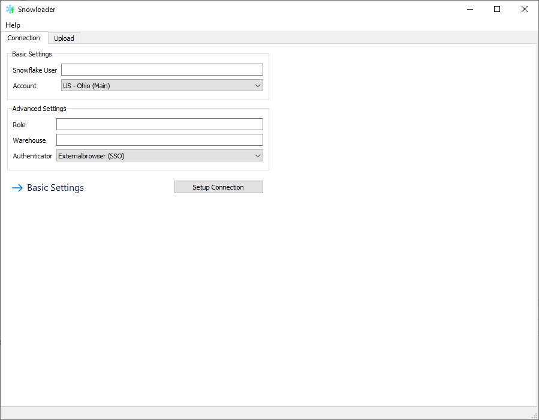
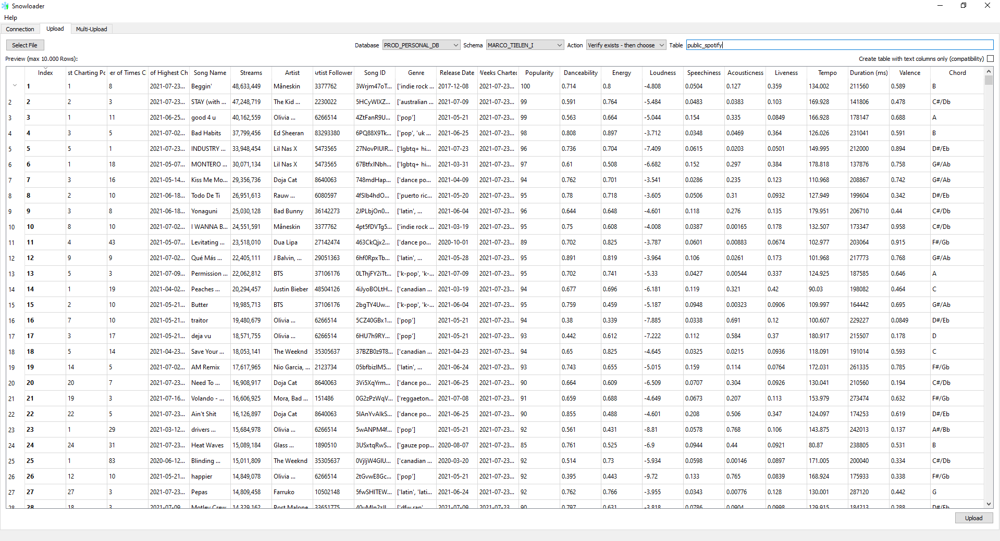

# Snowloader
Snowloader is an open source GUI for uploading (large) csv-files to Snowflake without the hassle of creating a table and defining data types. Simply connect to Snowflake, pick your file, database, schema and table name and snowloader will do the rest. Optionally append or replace in case the table is already existent.

### Screenshots
Create a connection:


Upload a file:


### Windows
There is a build/release available for windows that is created using PyInstaller. You can easily create your own build for other OS's using PyInstaller. Please see the PyInstaller section below for more details on including the Snowflake dialect and the configuration into the build.

### How to use Snowloader
#### Connection
Enter your Snowflake user name and select or enter (after selecting "Other") your Snowflake account. Your Snowflake account name is equal to your Snowflake URL without "https://" and "snowflake.computing.com" (e.g. xyz.us-east-1).

By default Snowloader assumes a SSO implementation and will connect using the externalbrowser option. Additionally it will make use of the default role and warehouse (they need to be [configured](https://docs.snowflake.com/en/sql-reference/sql/alter-user.html) in Snowflake!). In case you want to manually configure them, please press "Advanced Settings" and add/change the respective fields.

#### Upload
1. Select a file using the "Select file" button
2. Select your database in the related drop down box
3. Select your schema in the related drop down box
4. Enter your table name in the table field
5. Optionally, check the box for setting the data type for all fields to text/varchar. Otherwise the the tool will use the first 100k lines to determine the data types.
6. Press the Upload button. Snowloader will recognize existing tables and give you the option to append, replace or cancel your operation.

### Account dropdown configuration
Configuration is done using the snowflake_instances.json file, which needs to reside in the same location as the executable. This will fill the Account dropdown on the connection tab. Please enter a friendly name and the Snowflake account name in json-style. An example file is present.

### PyInstaller and Snowloader
You can run PyInstaller to create a compiled version of Snowloader for easy distribution, optionally including the configuration file for the account dropdown. Please note that generating a single file output will significantly increase to startup time of the application. Alternatively, you can build it without the --onefile parameter and use an installer like InstallForge, which will give better performance.

Please install PyInstaller using pip ```pip install pyinstaller``` and find the file named hook-sqlalchemy.py in your directory (Lib/site-packages/pyinstaller/hooks/). Open that file and add 'snowflake.sqlalchemy' to the hiddenimports array for pyinstaller to pick up the snowflake dialect. The end result should look like the following:
```hiddenimports = ['pysqlite2', 'MySQLdb', 'psycopg2', 'sqlalchemy.ext.baked', 'snowflake.sqlalchemy']```

Once that has been done. Please execute the following in the root of your project where snowloader.py is located
```pyinstaller --onefile --windowed --clean --add-data="main.ui;." --add-data="snowflake_instances.json;." --icon=snowflake.ico --add-data="snowflake.ico;." --splash="snowflake_splash.png" snowloader.py```

